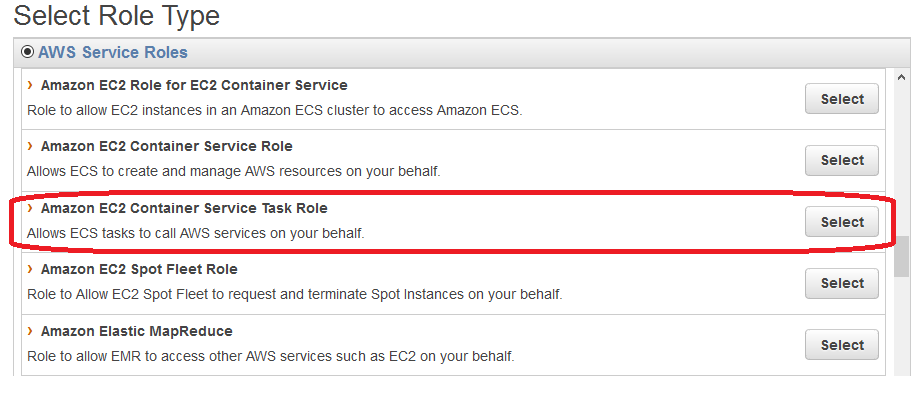
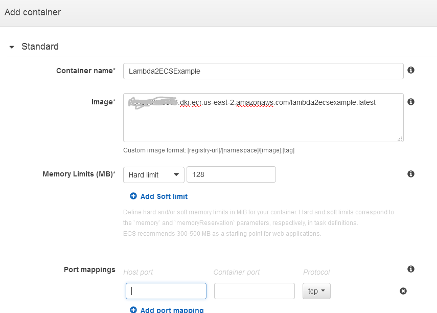
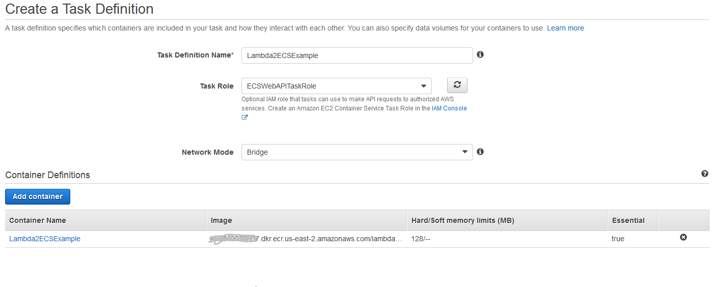
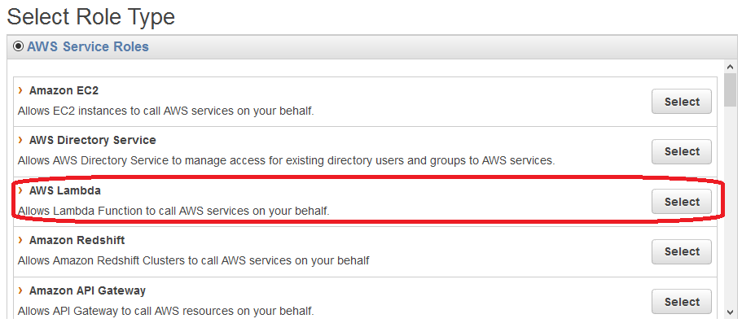
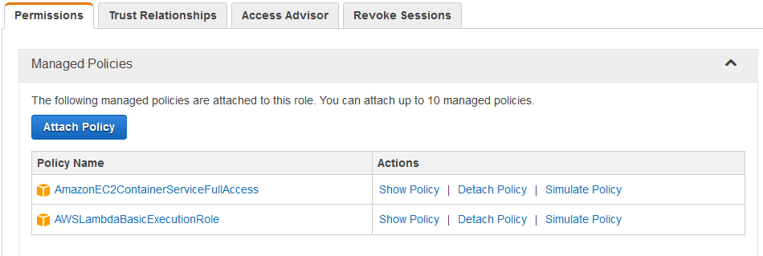
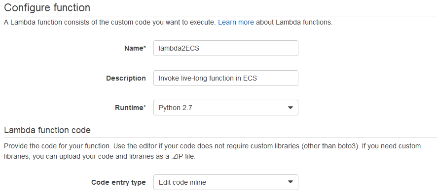
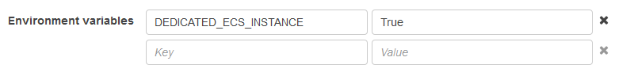

There are certain [resource limits](http://docs.aws.amazon.com/lambda/latest/dg/limits.html) in AWS lambda such as 300-second timeout, 50MB max deployment package size, etc. 

Your service, powered by a couple of lambda functions, was launched successfully and has been working smoothly without any problem for awhile. One day, your service gets popular enough, attracts more users and keeps crashing. Indeed, it gets killed by AWS Lambda service due to elevated execution time that exceeds  300-second hard limit. 

Re-architecturing application stack is unacceptable due to the time constraint. Your service needs to be mitigated/fixed as soon as possible.

**Solution:** Migrating your Lambda function to run in a Docker container managed by ECS. This method allows you to use your existing Lambda functions so you don’t need to code anything over again or re-architecturing application stack. Your new ECS task will still accept trigger event data as if it is working as a Lambda function. The whole migration process could be completed in less than 30 minutes (or 1 hour).

**General steps:**

1. Create an ECR repository in your AWS account (or use a public one if you don't mind).
2. Create a wrapper for invoking original Lambda function and deployment package.
3. Build docker container image and push to the repository mentioned in step 1.
4. Create a ECS task definition.
5. Change the original lambda function to run the corresponding ECS task. 


**Prerequisites:**

- If you are about to execute these steps on your local computer, please make sure that you have [AWS CLI](http://docs.aws.amazon.com/cli/latest/userguide/installing.html) and [Docker](https://docs.docker.com/engine/installation/) installed.

- Alternatively, you may launch and work from an EC2 instance using Amazon [ECS-optimized AMI](http://docs.aws.amazon.com/AmazonECS/latest/developerguide/ecs-optimized_AMI.html).

# AWSLambda2ECSExample

This is an implementation which converts a over-limit AWS lambda **JAVA** function to an ECS task while maintaining the invocation of the original AWS lambda function and preserving event data.

The new Lambda function will call ECS service API to run an ECS task that is equivalent to the original Lambda function. The event data of the Lambda function is passed to ECS task(s) as an environment variable as a JSON string.

How about ECS instance that hosts the new ECS task? Would it incur any charge? The answer is yes.
If the event that triggers your lambda function happens sporadically, You may configure launching the ECS instance only when the Lambda function is triggered and terminating it as soon as the ESC task is completed.  

## Configuration

### Create a Amazon ECR repository in your AWS account.
1. Pick a name your ECR repository, e.g., 'lambda2ecsexample'.
2. Follow instruction here to create an ECR repository: http://docs.aws.amazon.com/AmazonECR/latest/userguide/repository-create.html.

### Create a wrapper for the origin Lambda function
1. Prepare a main class that:
	- Create Lambda handler object.
	- Invoke the handleRequest method and pass the value of the "LAMBDA_INPUT" environment variable as the input argument. 

For example:

```javascript 
    
    public class ECSTaskWrapper {
        public static void main(String[] args) {
            
            String input = System.getenv("LAMBDA_INPUT");
            if (input == null || input.length() == 0) {
			    System.out.println("Not being called from an AWS Lambda function.");
			    System.exit(1);
		    }

		    AWSLambdaExample lde = new AWSLambdaExample();
    
		    System.out.println(lde.handleRequest(input, null));
	    }
    }
```

The complete code snippets that may terminate ECS instance once the ECS task is completed could be found here: [ECSTaskWrapper.java](src/Lambda2ECSExample/ECSTaskWrapper.java)

### Build java application deployment package
1. Use any method to create a runnable .jar file for the lambda function and its wrapper.
	- [Packaging Programs in JAR Files](http://docs.oracle.com/javase/tutorial/deployment/jar/)
	- [ Creating a New Runnable JAR File with Eclipse](http://help.eclipse.org/neon/index.jsp?topic=%2Forg.eclipse.jdt.doc.user%2Ftasks%2Ftasks-37.htm)


Note: The runnable .jar file should include all the necessary libraries.

### Build docker image and push to the repository 
1. Create a [Dockerfile](Refs/Dockerfile)
 in the same folder with the runnable .jar file
(Assume that, the newly created .jar file is 'Lambda2ECSExample.jar').
   
```bash
    
    FROM ubuntu:14.04
     
    # Install Java.
    RUN \
       sed -i 's/# \(.*multiverse$\)/\1/g' /etc/apt/sources.list && \ 
       apt-get update && \
       apt-get -y upgrade && \
       apt-get install -y build-essential && \
       apt-get install -y software-properties-common && \
       apt-get install -y byobu curl git htop man unzip vim wget && \
       apt-get install -y openjdk-7-jre && \
       rm -rf /var/lib/apt/lists/*
    
    # Define working directory.
    WORKDIR /data
    
    ADD Lambda2ECSExample.jar Lambda2ECSExample.jar
    
    # Define commonly used JAVA_HOME variable
    ENV JAVA_HOME /usr/lib/jvm/java-7-openjdk-amd64
    
    # Define default command.
    CMD ["java", "-jar", "Lambda2ECSExample.jar"]
```

2.Build Docker container image and push to your ECR repository (or Docker hub): 


- Retrieve the docker login command that you can use to authenticate your Docker client to your registry:

```bash
     $(aws ecr get-login --region us-east-2)
```

- Build your Docker image:

```bash
    docker build -t lambda2ecsexample .
```

- After the build completes, tag your image so you can push the image to this repository:

```bash
docker tag lambda2ecsexample:latest <your AWS accountId>.dkr.ecr.us-east-2.amazonaws.com/lambda2ecsexample:latest
```

- Push this image to your newly created AWS repository:

```bash
docker push <your AWS accountId>.dkr.ecr.us-east-2.amazonaws.com/lambda2ecsexample:latest
```

### Create an IAM role for ECS task execution

- Pick a name for the role, e.g., ECSLambdaExecutionRole:.

- Select Amazon EC2 Container Service Task Role type:


- Attach or add necessary permissions for your ECS task.


### Create ECS task definition


#### Add a new Container
- Use your image and tag defined above.
- Choose appropriate memory limit for the task.
- You may skip Port mappings since this is a lambda-equivalent function.
- You may additionally specify other parameters for your container such as volumes, etc.



#### Update task definition
- Select newly created IAM role for the task.



## Create the Lambda2ECS Lambda function

#### Lambda IAM Role for execution

- Pick a name for an IAM role used by Lambda function, e.g., Lambda2ECSRole.
- Select AWS Lambda role type.



#### Attach necessary policy to Lambda function's IAM role.
- In addition to basic execution role of a Lambda function, it is needed to attach permission  policy to allow new Lambda function to call AWS ECS.




### Create an in-line Lambda function

- Pick a name for the new Lambda function that will forward/delegate the event-based Lambda invocation to ECS task, e.g., 'lambda2ECS'.
- Update description.
- Select Python as the primary language.
- Select 'Edit code inline' as the Code entry type.
- Paste the following code snippets into the function's body. 




```python
    
    import boto3
    import json
    
    def lambda_handler(event, context):
        
        ecs = boto3.client('ecs')
        
        response = ecs.run_task(
            cluster='AnyCluster',
            taskDefinition='Lambda2ECSExample',
            overrides={
                'containerOverrides': [
                    {
                        'name': 'Lambda2ECSExample',
                        'environment': [
                            {
                                'name': 'LAMBDA_IMPUT',
                                'value': json.dumps(event)
                            },
                        ]
                    },
                ]
            },
            count=1
        )

        return "response={}".format(response)

```


**Note:**

- You may select any existing ECS cluster for the task (if any).
- Alternatively, you may create an empty cluster for the new ECS task. In order to launch an on-demand ECS instance and free up the ECS instance as soon as the task is completed, just add environment variable 'DEDICATED_ECS_INSTANCE' and set it to 'True' (case sensitive) to the Lambda function. 

- The complete code snippets that may launch on-demand ECS instance could be found here: [LambdaFunction](Refs/LambdaFunction)

## Updating your Lambda trigger(s)
- Now the last step is updating your current event source(s) that triggers your (old) Lambda function to trigger the new Lambda function instead.
- From now, new Lambda function will trigger an ECS task that is functionally equivalent to the old one without any limits.
- Every time ECS task is invoked, it will complete the task as if it is run in Lambda environment, e.g., processing event data. 
 
## Automation

- Most of these steps above can be done quickly via CloudFormation template(s) which will be added later.

## References
### Lambda
[https://aws.amazon.com/lambda/](https://aws.amazon.com/lambda/)

[https://docs.aws.amazon.com/lambda/latest/dg/python-lambda.html](https://docs.aws.amazon.com/lambda/latest/dg/python-lambda.html)

### ECS
[https://aws.amazon.com/ecs/](https://aws.amazon.com/ecs/)

[http://docs.aws.amazon.com/AmazonECS/latest/developerguide/docker-basics.html](http://docs.aws.amazon.com/AmazonECS/latest/developerguide/docker-basics.html)

### Lambda ECS Worker Pattern
[Better Together: Amazon ECS and AWS Lambda](https://aws.amazon.com/blogs/compute/better-together-amazon-ecs-and-aws-lambda/)

